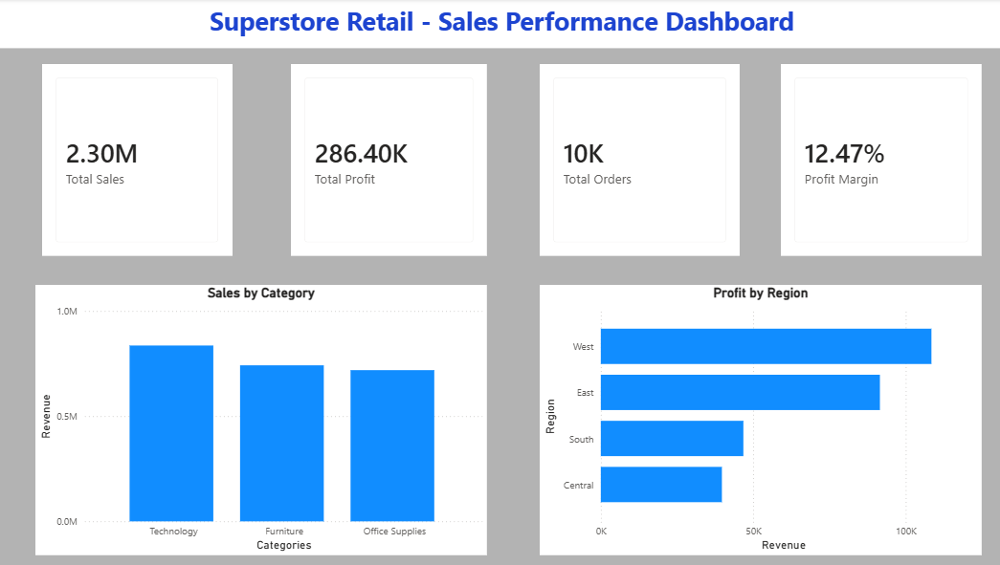
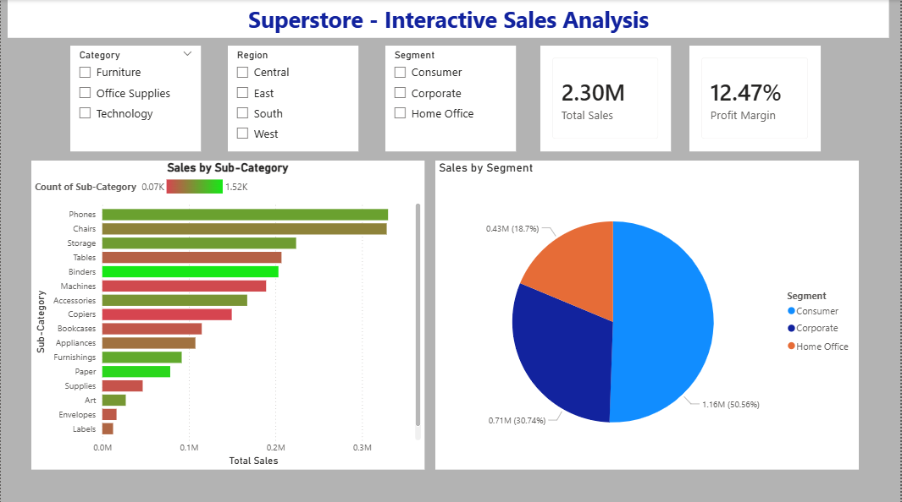
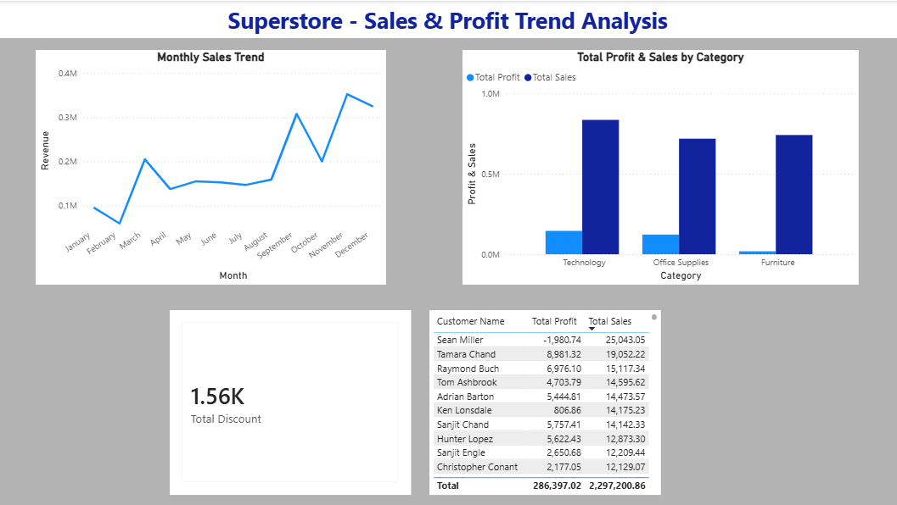

# 📊 Superstore Retail — Sales Performance Dashboard
### Power BI Capstone Project | Business Systems Analytics Portfolio

---

## 📌 Project Overview

This Power BI Capstone Dashboard analyzes retail sales performance data from the widely recognized Superstore dataset (Kaggle). The project demonstrates end-to-end business intelligence skills — from raw data ingestion and transformation to interactive dashboard design and executive-level reporting.

This project mirrors the kind of reporting and analytics work performed by Business Systems Analysts and Data Analysts in retail, distribution, and ERP-driven business environments.

---

## 🖼️ Dashboard Preview

### Page 1 — Executive Summary


### Page 2 — Interactive Analysis


### Page 3 — Sales & Profit Trend Analysis


---

## 🎯 Business Questions Answered

- Which product category drives the highest revenue and profit?
- Which region is the most profitable market?
- How do sales trend month over month across the year?
- Which customer segment generates the most revenue?
- Who are the top 10 customers by total sales?
- What is the overall profit margin across all orders?
- How does profit compare to sales across product categories?
- Which sub-categories are underperforming versus top performers?

---

## 📈 Key Business Insights

| Insight | Finding |
|---|---|
| 💰 Total Sales | $2.30M |
| 📈 Total Profit | $286.40K |
| 🛒 Total Orders | 10,000 |
| 📊 Profit Margin | 12.47% |
| 🏆 Top Category | Technology — highest sales and profit |
| 🗺️ Top Region | West leads in profitability |
| 👥 Top Segment | Consumer — 50.56% of total sales |
| 🏅 Top Customer | Sean Miller — $25,043.05 in sales |
| 📅 Peak Season | November — December (holiday sales surge) |
| 💸 Total Discounts | $1.56K given across all orders |

---

## 🗂️ Dashboard Pages

### Page 1 — Executive Summary
High-level overview for leadership and stakeholders:
- Total Sales KPI Card — $2.30M
- Total Profit KPI Card — $286.40K
- Total Orders KPI Card — 10K
- Profit Margin KPI Card — 12.47%
- Sales by Category — Clustered Column Chart
- Profit by Region — Horizontal Bar Chart

### Page 2 — Interactive Analysis
Drill-down analysis with dynamic filtering:
- Category Slicer — Furniture, Office Supplies, Technology
- Region Slicer — Central, East, South, West
- Segment Slicer — Consumer, Corporate, Home Office
- Sales by Sub-Category — Conditional formatted Bar Chart
- Sales by Segment — Pie Chart
- Live Total Sales and Profit Margin KPI Cards

### Page 3 — Trend Analysis
Time-based and comparative analysis:
- Monthly Sales Trend — Line Chart (Jan → Dec)
- Sales vs Profit by Category — Clustered Column Chart
- Top Customers Table — sorted by Total Sales descending
- Total Discount KPI Card — $1.56K

---

## 🧮 DAX Measures Written

```
Total Sales     = SUM('orders'[Sales])
Total Profit    = SUM('orders'[Profit])
Total Orders    = COUNT('orders'[Order ID])
Profit Margin   = DIVIDE(SUM('orders'[Profit]), SUM('orders'[Sales]))
Total Discount  = SUM('orders'[Discount])
```

---

## 🔧 Tools & Skills Used

- **Power BI Desktop** — Multi-page report building
- **Power Query Editor** — Data loading and transformation
- **DAX (Data Analysis Expressions)** — Custom business measures
- **Conditional Formatting** — Red to green gradient on sub-categories
- **Interactive Slicers** — Dynamic cross-filtering across all visuals
- **Table Visuals** — Customer ranking and performance tables
- **Kaggle Dataset** — Superstore Sales (9,994 rows, 21 columns)

---

## 💼 Business Context

This dashboard simulates real-world retail analytics used by Business Systems Analysts and Data Analysts to support executive decision-making. Key use cases include:

- Identifying top and bottom performing product lines
- Monitoring regional sales and profit distribution
- Tracking seasonal sales trends for inventory planning
- Analyzing customer segment contribution to revenue
- Flagging high-value customers for relationship management

---

## 👤 About the Author

**Sharon Paul**
IT & ERP Business Systems Professional | Milwaukee, WI
Skills: Power BI · DAX · SQL · Sage 100 ERP · WooCommerce · Business Analysis · Data Analytics

🔗 [SQL Business Analytics Portfolio](https://github.com/sharonpaul604-wq/sql-business-analytics)
🔗 [Herbsmith Power BI Dashboard](https://github.com/sharonpaul604-wq/powerbi-sales-dashboard)

---

*This Capstone project is the final milestone of a structured Power BI learning journey — demonstrating proficiency in data loading, transformation, DAX calculations, interactive dashboard design, and business insight generation.*
